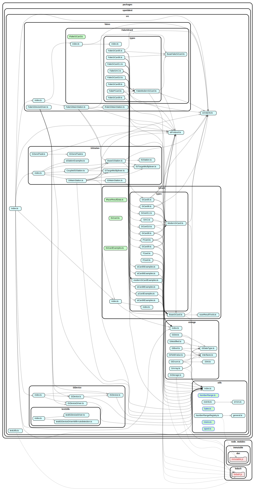
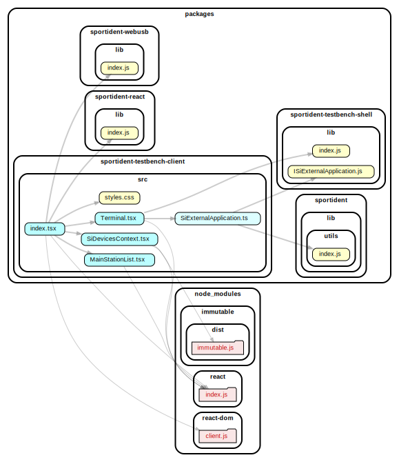

There is an [online testbench](./testbench/).

There is a [test coverage report](./coverage/lcov-report/index.html).

These are the current `src` dependencies:

These are the current `testbench` dependencies:

